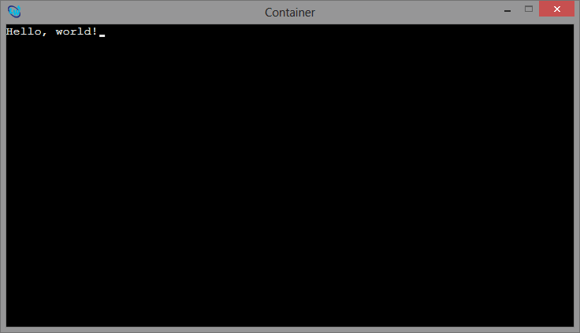

# The CURSED Package

The `cursed` package adds a subclass of the [output-pane](http://www.lispworks.com/documentation/lw61/CAPRM/html/capiref-275.htm#marker-4173290) element in [LispWorks'](http://www.lispworks.com) [CAPI](http://www.lispworks.com/documentation/lw61/CAPUG-M/html/capiuser-m.htm). It's designed to allow for simple, console-style display of text, but within a graphical UI.

## Quickstart

You can immediately start using the `cursed-pane` by just containing one.

	CL-USER > (setf c (capi:contain (make-instance 'cursed-pane)))
	#<CURSED-PANE  21C83D3B>
	

	
Once the pane is up, you can use one of the many available print functions to render text on it.

	CL-USER > (princ-to-pane "Hello, world!" c :foreground :red)
	NIL

You can use the `cursed-pane-cursor-x` and `cursed-pane-cursor-y` accessor methods to `setf` the cursor position. The cursor can also be toggled with the `cursed-pane-cursor-visible-p` accessor.

